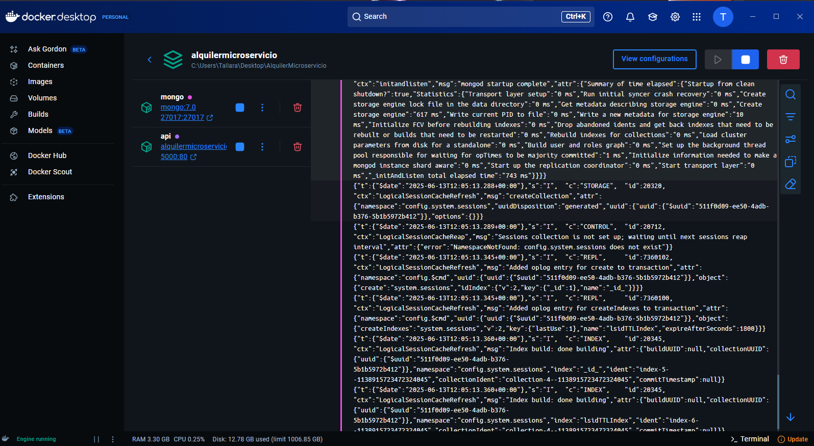

# Verificación de despliegue del microservicio `AlquilerMicroservicio`

Este documento certifica que el microservicio ha sido configurado correctamente y se ejecuta de forma estable dentro de un entorno Docker.

## Componentes configurados

- Proyecto principal: `AlquilerMicroservicio.API`
- Servicios adicionales:
  - MongoDB (versión 7.0)
- Orquestador: Docker Compose
- Imagen base .NET: SDK 9.0 + ASP.NET 9.0
- Documentación: Swagger activado y accesible

## Docker Compose

Archivo `docker-compose.yml` correctamente configurado con:
- Redirección de puertos:
  - `5000:80` para la API
  - `27017:27017` para MongoDB
- Variables de entorno aplicadas:
  - `ASPNETCORE_ENVIRONMENT=Development`
  - `ASPNETCORE_URLS=http://+:80`

## Verificaciones realizadas

-  `docker-compose up --build` funciona correctamente.
-  Swagger accesible en: http://localhost:5000/swagger
-  MongoDB iniciado y funcional.
-  Variables de entorno aplicadas correctamente.
-  Middleware de HTTPS deshabilitado para evitar redirecciones erróneas.

## Captura de ejecución exitosa

---

_Fecha de validación: 13 de junio de 2025_
